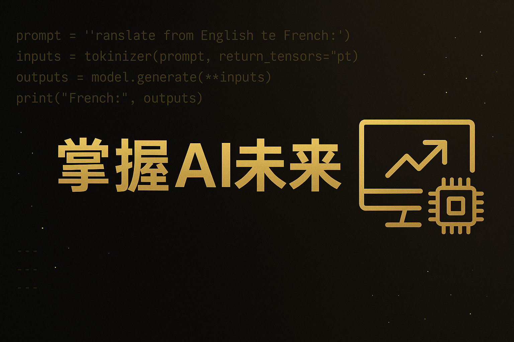
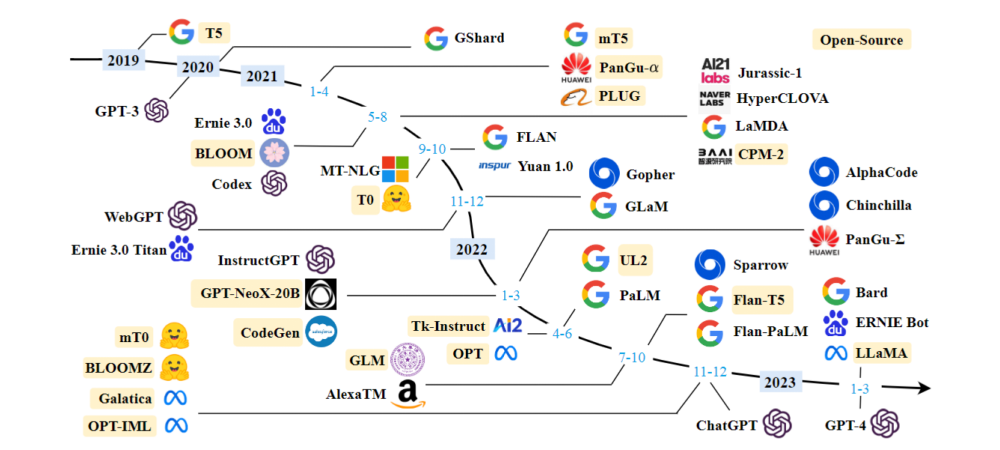
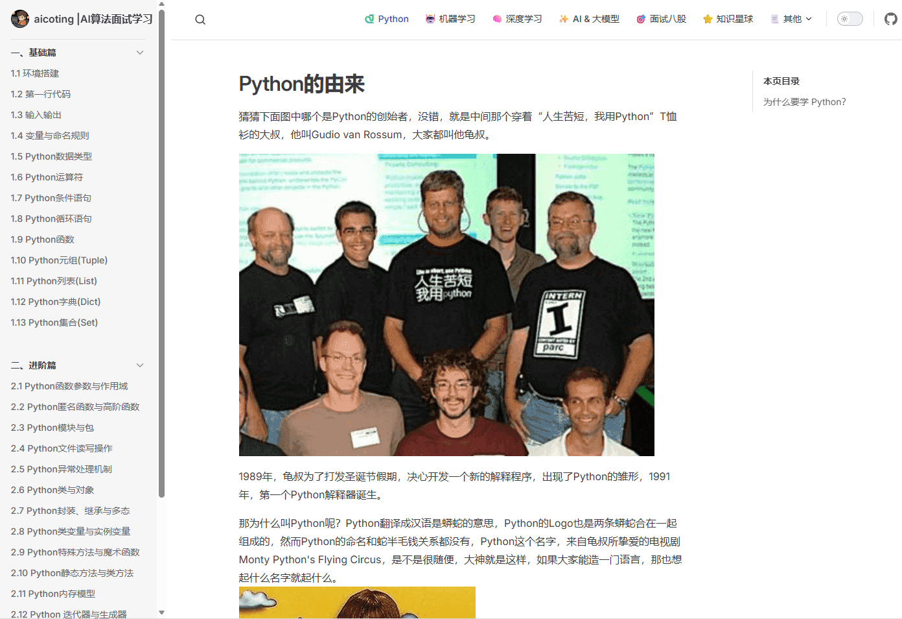
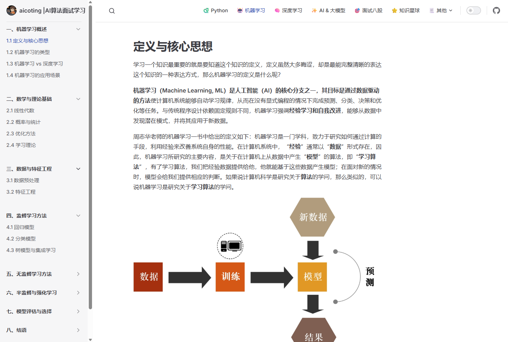
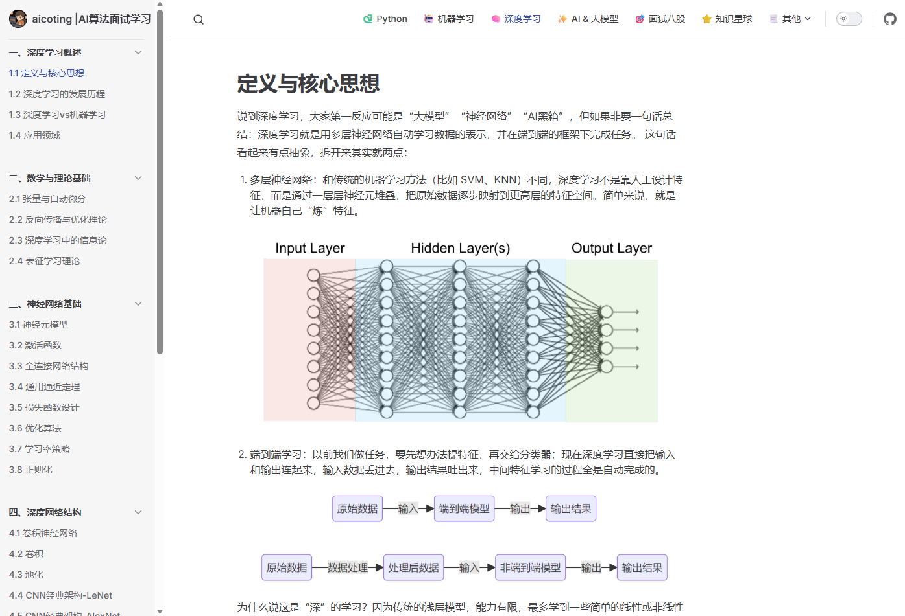
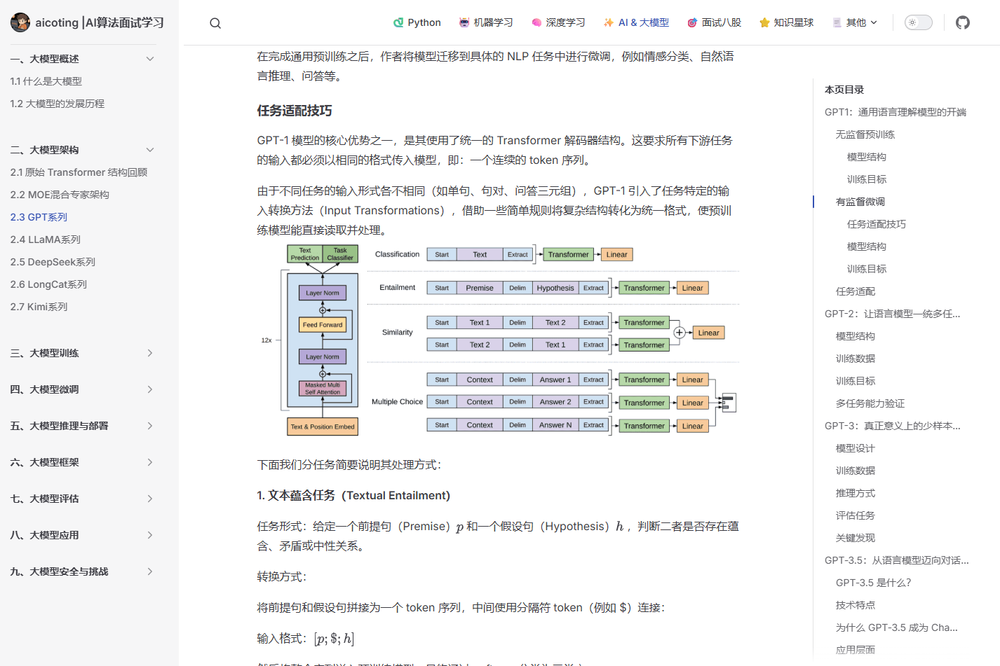

<!--
 * @Author: zhangting
 * @Date: 2025-05-22 11:37:41
 * @LastEditors: Do not edit
 * @LastEditTime: 2025-10-28 15:58:21
 * @FilePath: /zhangting/LLMHub/README.md
-->

  <h2 align="center">AIHub</h2>
  

    一个包含机器学习、深度学习与大语言模型（LLM）知识的最全八股！
     
     
    <a href="https://aicoting.cn"><strong>» 推荐aicoting网站在线阅读 »</strong></a>
     
  

  
  
  
  

  &emsp;
  &emsp;
  &emsp;
  &emsp;
  &emsp;
  <!-- visitor -->
  &emsp;
  <!-- wakatime -->    
  

本项目旨在系统整理与分享AI与大语言模型（LLM）相关的核心知识、面试内容、实际应用场景及部署技巧。内容涵盖从基础概念、主流模型对比、Prompt 设计、模型微调到工程部署的完整流程，帮助开发者、研究者以及求职者高效掌握大模型领域的关键能力。

## 目录
- 📚 [计算机专业基础知识](./计算机专业基础知识/)
    - 📗 [计算机网络](./计算机专业基础知识/计算机网络.md)
    - 📘 [操作系统](./计算机专业基础知识/操作系统.md)
    - 📙 [数据库系统](./计算机专业基础知识/数据库系统.md)
- 🖥️ [开发](./开发/)
    - ⚒️ [开发工具](./开发/开发工具/)
        - 🔨[Git安装教程及常用命令！](./开发/开发工具/Git安装教程及常用命令！.md)
        - ⛏️[cursor使用教程！](./开发/开发工具/cursor使用教程！.md)
        - 🪚[才发现TensorBoard是个可视化的神器！](./开发/开发工具/才发现TensorBoard是个可视化的神器！.md)
    - 🛠️ [开发语言](./开发/开发工具/)
        - 🐍 [Python知识点](./开发/Python知识点.md)
- 🐫 [机器学习](./ml/)
    - 🐱 [机器学习概述](./ml/一、机器学习概述/)
        - 😼[定义与核心思想](./ml/一、机器学习概述/1.1%20定义与核心思想.md)
        - 😽[机器学习的类型](./ml/一、机器学习概述/1.2%20机器学习的类型.md)
        - 🙀[机器学习 vs 深度学习](./ml/一、机器学习概述/1.3%20机器学习%20vs%20深度学习.md)
        - 😻[机器学习的应用场景](./ml/一、机器学习概述/1.4%20机器学习的应用场景.md)
    - 🪄 [数学与理论基础](./ml/二、数学与理论基础/)
        - 🐎 [线性代数](./ml/二、数学与理论基础/2.1%20线性代数.md)
        - 🐏 [概率与统计](./ml/二、数学与理论基础/2.2%20概率与统计.md)
        - 🎣 [优化方法](./ml/二、数学与理论基础/2.3%20优化方法.md)
        - 🐳 [学习理论](./ml/二、数学与理论基础/2.4%20学习理论.md)
    - 🐋 [数据与特征工程](./ml/三、数据与特征工程/)
        - 🐬 [ 数据预处理](./ml/三、数据与特征工程/3.1%20数据预处理.md)
        - 🐟 [特征工程](./ml/三、数据与特征工程/3.2%20特征工程.md)
    - 🐳 [监督学习方法](./ml/四、监督学习方法/)
        - 🐠 [回归模型](./ml/四、监督学习方法/4.1%20回归模型.md)
        - 🐡 [分类模型](./ml/四、监督学习方法/4.2%20分类模型.md)
        - 🦈 [树模型与集成学习](./ml/四、监督学习方法/4.3%20树模型与集成学习.md)
    - 🐙[无监督学习方法](./ml/五、无监督学习方法/)
        - 🐟 [聚类](./ml/五、无监督学习方法/5.1%20聚类.md)
        - 🦐 [降维与表示学习](./ml/五、无监督学习方法/5.2%20降维与表示学习.md)
        - 🦑 [概率图模型](./ml/五、无监督学习方法/5.3%20概率图模型.md)
    - 🐹 [半监督与强化学习](./ml/六、半监督与强化学习/)
        - 💽 [半监督学习](./ml/六、半监督与强化学习/6.1%20半监督学习.md)
        - 💽 [强化学习](./ml/六、半监督与强化学习/6.2%20强化学习.md)
- 🐫 [深度学习](./deep-learning/)
    - 🐱 [深度学习概述](./deep-learning/一、深度学习概述/)
        - 😼[定义与核心思想](./deep-learning/一、深度学习概述/1.1%20定义与核心思想.md)
        - 😽[深度学习的发展历程](./deep-learning/一、深度学习概述/1.2%20深度学习的发展历程.md)
        - 🙀[深度学习vs机器学习](./deep-learning/一、深度学习概述/1.3%20深度学习vs机器学习.md)
        - 😻[应用领域](./deep-learning/一、深度学习概述/1.4%20应用领域.md)
    - 🪄 [数学与理论基础](./deep-learning/二、数学与理论基础/)
        - 🐎 [张量与自动微分](./deep-learning/二、数学与理论基础/2.1%20张量与自动微分.md)
        - 🐏 [反向传播与优化理论](./deep-learning/二、数学与理论基础/2.2%20反向传播与优化理论.md)
        - 🎣 [深度学习中的信息论](./deep-learning/二、数学与理论基础/2.3%20深度学习中的信息论.md)
        - 🐂 [表征学习理论](./deep-learning/二、数学与理论基础/2.4%20表征学习理论.md)
    - 🐳 [神经网络基础](./deep-learning/三、神经网络基础/)
        - 🐋[神经元模型](./deep-learning/三、神经网络基础/3.1%20神经元模型.md)
        - 🐬[激活函数](./deep-learning/三、神经网络基础/3.2%20激活函数.md)
        - 🐟[全连接网络结构](./deep-learning/三、神经网络基础/3.3%20全连接网络结构.md)
        - 🐳[通用逼近定理](./deep-learning/三、神经网络基础/3.4%20通用逼近定理.md)
        - 🐠[损失函数设计](./deep-learning/三、神经网络基础/3.5%20损失函数设计.md)
        - 🐡[优化算法](./deep-learning/三、神经网络基础/3.6%20优化算法.md)
        - 🦈[学习率策略](./deep-learning/三、神经网络基础/3.7%20学习率策略.md)
        - 🐙[正则化](./deep-learning/三、神经网络基础/3.8%20正则化.md)
    - 🐳 [深度网络结构](./deep-learning/四、深度网络结构/)
        - 🦐 [卷积神经网络](./deep-learning/四、深度网络结构/4.1%20卷积神经网络.md)
        - 🦑 [卷积层](./deep-learning/四、深度网络结构/4.2%20卷积层.md)
        - 🦋 [池化](./deep-learning/四、深度网络结构/4.3%20池化.md)
        - 🐹 [经典架构-LeNet](./deep-learning/四、深度网络结构/4.4%20CNN经典架构-LeNet.md)
        - 💽 [经典架构-AlexNet](./deep-learning/四、深度网络结构/4.5%20CNN经典架构-AlexNet.md)
        - 🦐 [经典架构-VGG](./deep-learning/四、深度网络结构/4.6%20CNN经典架构-VGG.md)
        - 🦑 [经典架构-ResNet](./deep-learning/四、深度网络结构/4.7%20CNN经典架构-ResNet.md)
        - 🦋 [经典架构-DenseNet](./deep-learning/四、深度网络结构/4.8%20CNN经典架构-DenseNet.md)
        - 🐹 [经典架构-EfficientNet](./deep-learning/四、深度网络结构/4.9%20CNN经典架构-EfficientNet.md)
        - 💽 [标准RNN](./deep-learning/四、深度网络结构/4.10%20标准RNN.md)
        - 🦐 [LSTM](./deep-learning/四、深度网络结构/4.11%20LSTM.md)
        - 🦑 [GRU](./deep-learning/四、深度网络结构/4.12%20GRU.md)
        - 🦋 [Seq2Seq](./deep-learning/四、深度网络结构/4.13%20Seq2Seq.md)
        - 🐹 [Attention](./deep-learning/四、深度网络结构/4.14%20Attention.md)
        - 💽 [Encoder-Decoder架构](./deep-learning/四、深度网络结构/4.15%20Encoder-Decoder架构.md)
        - 🦐 [Transformer整体架构](./deep-learning/四、深度网络结构/4.16%20Transformer整体架构.md)
        - 🦑 [自注意力机制](./deep-learning/四、深度网络结构/4.17%20自注意力机制.md)
        - 🦋 [从零开始实现Transformer](./deep-learning/四、深度网络结构/4.18%20从零开始实现Transformer.md)
        - 🐹 [Bert](./deep-learning/四、深度网络结构/4.19%20Bert.md)
        - 💽 [GPT](./deep-learning/四、深度网络结构/4.20%20GPT.md)
        - 💽 [Vision Transformer](./deep-learning/四、深度网络结构/4.21%20Vision%20Transformer.md)
    - 🐳 [模型训练与优化](./deep-learning/五、模型训练与优化/)
        - 🦐 [Dropout](./deep-learning/五、模型训练与优化/5.1%20Dropout.md)
        - 🦑 [Normalization](./deep-learning/五、模型训练与优化/5.2%20Normalization.md)
        - 🦋 [Label Smoothing](./deep-learning/五、模型训练与优化/5.3%20Label%20Smoothing.md)
        - 🐹 [Gradient Clipping](./deep-learning/五、模型训练与优化/5.4%20Gradient%20Clipping.md)
        - 💽 [数据增强](./deep-learning/五、模型训练与优化/5.5%20数据增强.md)
- 🦜 [大模型](./大模型)
    - 📚 [基础知识](./大模型/基础知识/)
        - 📕 [大模型幻觉：你信它，它却在胡说？](./大模型/基础知识/大模型幻觉：你信它，它却在胡说？.md)
    - 📑 [大模型架构](./大模型/大模型架构/)
        - 📘 [一文弄懂MOE](./大模型/大模型架构/一文弄懂MOE.md)
    - 🔔 [经典大模型](./大模型/经典大模型/)
        - 🏀 [GPT](./大模型/经典大模型/GPT/)
            - 🎱[GPT1：通用语言理解模型的开端](./大模型/经典大模型/GPT/GPT1：通用语言理解模型的开端.md)
            - ⚽ [GPT-2：让语言模型一统多任务学习江湖](./大模型/经典大模型/GPT/GPT-2：让语言模型一统多任务学习江湖.md)
            - ⚾ [GPT-3：真正意义上的少样本学习模型来了！](./大模型/经典大模型/GPT/GPT-3：真正意义上的少样本学习模型来了！.md)
            - 🥎[GPT‑3.5：从语言模型迈向对话智能的过渡之作](./大模型/经典大模型/GPT/GPT‑3.5：从语言模型迈向对话智能的过渡之作.md)
            - 🏐[GPT‑4：多模态大规模模型，开启更智能时代](./大模型/经典大模型/GPT/GPT‑4：多模态大规模模型，开启更智能时代.md)
            - ⚽ [GPT-5：天变了吗？还是风停了？](./大模型/经典大模型/GPT/GPT-5：天变了吗？还是风停了？.md)
        - 📣[LLAMA](./大模型/经典大模型/LLAMA/)
            - 📢[一文读懂LLAMA](./大模型/经典大模型/LLAMA/一文读懂LLAMA.md)
            - 🔈[LLaMA2-大模型开源了！](./大模型/经典大模型/LLAMA/LLaMA2-大模型开源了！.md)
            - 🔉[LLaMA3：离AGI更近一步？](./大模型/经典大模型/LLAMA/LLaMA%203：离%20AGI%20更近一步？.md)
        - 📠 [Grok](./大模型/经典大模型/Grok/)
            - 📱 [马斯克旗下xAI首个开源大模型全面解析](./大模型/经典大模型/Grok/Grok-1：马斯克旗下%20xAI%20首个开源大模型全面解析.md)
            - 🙋‍♂️[一文了解DeepSeek系列模型的演进与创新](./大模型/经典大模型/DeepSeek/一文了解%20DeepSeek%20系列模型的演进与创新.md)
            - 🙋[一文搞懂DeepSeekLLM](./大模型/经典大模型/DeepSeek/一文搞懂DeepSeek%20LLM.md)
            - 💁[DeepSeek-V2架构解读](./大模型/经典大模型/DeepSeek/DeepSeek-V2%20架构解读.md)
            - 💁‍♂️[DeepSeek-V3架构解析](./大模型/经典大模型/DeepSeek/DeepSeek-V3%20架构解析.md)
            - 💁‍♀️[DeepSeek-R1架构解析：如何通过强化学习激发大模型的推理能力？](./大模型/经典大模型/DeepSeek/DeepSeek-R1%20架构解析：如何通过强化学习激发大模型的推理能力？.md)
    - 🤾‍♂️[微调技术](./大模型/微调技术/)
        - 🤸‍♀️[一文搞懂什么是微调](./大模型/微调技术/一文搞懂什么是微调.md)
        - 🤸‍♂️[一文搞懂微调技术的发展与演进](./大模型/微调技术/一文搞懂微调技术的发展与演进.md)
        - 🤸[LORA](./大模型/微调技术/LORA/)
            - ⛹️[一文搞懂LoRA如何高效微调大模型](./大模型/微调技术/LORA/一文搞懂%20LoRA%20如何高效微调大模型.md)
            - ⛹️‍♂️[LoRA详细步骤解析](./大模型/微调技术/LORA/LoRA详细步骤解析.md)
            - ⛹️‍♀️[一文搞懂如何用QLoRA高效微调大语言模型](./大模型/微调技术/LORA/一文搞懂如何用%20QLoRA%20高效微调大语言模型.md)
            - 🤾‍♀️[一文理解AdaLoRA动态低秩适配技术](./大模型/微调技术/LORA/一文理解%20AdaLoRA%20动态低秩适配技术.md)
        - 🚴‍♀️[一文理解提示微调（Prefix Tuning_Prompt Tuning_P Tuning）](./大模型/微调技术/一文理解提示微调（Prefix%20Tuning_Prompt%20Tuning_P%20Tuning）.md)
        - 🚵‍♀️[一文弄懂RLHF（基于人类反馈的强化学习）的核心原理](./大模型/微调技术/一文弄懂RLHF%20（基于人类反馈的强化学习）的核心原理.md)
        - 🚲[从原理到实战：RLHF（人类反馈强化学习）完整流程](./大模型/微调技术/从原理到实战：RLHF（人类反馈强化学习）完整流程.md)
        - 🚴‍♂️[一文理解监督微调(SFT)在大语言模型训练中的作用](./大模型/微调技术/一文理解监督微调(SFT)在大语言模型训练中的作用.md)
        - 🚵‍♂️[一文理解PPO的核心机制与大模型中的应用](./大模型/微调技术/一文理解%20PPO%20的核心机制与大模型中的应用.md)
        - 🚴[DPO是怎么通过偏好数据直接优化大模型的？](./大模型/微调技术/DPO是怎么通过偏好数据直接优化大模型的？.md)
        - 🚵[GRPO：让大模型对齐更高效的优化方法](./大模型/微调技术/GRPO：让大模型对齐更高效的优化方法.md)
    - 🍔[大模型框架](./大模型/大模型框架/)
        - 🍕[大模型工程框架生态全览](./大模型/大模型框架/大模型工程框架生态全览.md)
        - 🍟[深入LangChain：大模型工程框架架构全解析](./大模型/大模型框架/深入%20LangChain：大模型工程框架架构全解析.md)
        - 🌭[手把手带你使用LangChain框架从0实现RAG](./大模型/大模型框架/手把手带你使用LangChain框架从0实现RAG.md)
        - 🍿[深入vLLM：高性能大模型推理框架解析](./大模型/大模型框架/深入%20vLLM：高性能大模型推理框架解析.md)
        - 🥓[知识管理与RAG框架全景：从LlamaIndex到多框架集成](./大模型/大模型框架/知识管理与%20RAG%20框架全景：从%20LlamaIndex%20到多框架集成.md)
        - 🥚[大模型微调框架之TRL](./大模型/大模型框架/大模型微调框架之TRL.md)
        - 🍳[大模型框架之PEFT](./大模型/大模型框架/大模型框架之PEFT.md)
        - 🧇[大模型微调框架之LLaMA Factory](./大模型/大模型框架/大模型微调框架之LLaMA%20Factory.md)
        - 🥞[认识Unsloth框架：大模型高效微调的利器](./大模型/大模型框架/认识%20Unsloth%20框架：大模型高效微调的利器.md)
        - 🧈[大模型框架性能优化策略：延迟、吞吐量与成本权衡](./大模型/大模型框架/大模型框架性能优化策略：延迟、吞吐量与成本权衡.md)
        - 🍞[Serverless架构下的大模型框架落地实践](./大模型/大模型框架/Serverless%20架构下的大模型框架落地实践.md)
    - ✌️[大模型评估](./大模型/大模型评估/)
        - 🫵[大模型的好坏怎么进行评估？](./大模型/大模型评估/大模型的好坏怎么进行评估？.md)
        - 👆[大模型评估方法论：指标拆解与技术路径](./大模型/大模型评估/大模型评估方法论：指标拆解与技术路径.md)
        - 🤞[场景驱动的大模型评估：行业落地的挑战与实践](./大模型/大模型评估/场景驱动的大模型评估：行业落地的挑战与实践.md)
    - 🧐 [RAG](./RAG/doc/)
        - 🦋 [什么是RAG？一文搞懂检索增强生成技术](./大模型/RAG/doc/什么是RAG？一文搞懂检索增强生成技术.md)
        - 🤗[一文搞懂RAG 的文档解析](./大模型/RAG/doc/一文搞懂RAG%20的文档解析.md)
        - 🙂[一文搞懂RAG的切分策略](./大模型/RAG/doc/一文搞懂RAG的切分策略.md)
        - 😮[RAG-embedding篇](./大模型/RAG/doc/RAG-embedding篇.md)
        - 😜[RAG 信息检索：如何让模型找到‘对的知识’](./大模型/RAG/doc/RAG%20信息检索：如何让模型找到‘对的知识’.md)
    - 📑 [Data-Juicer原理及使用](./大模型/Data-Juicer.md)
    - 🔔 [论文/技术报告](./paper)
        - 🚛[神经网络经典论文](./paper/卷积神经网络经典论文/)
            - 🚗[AlexNet](./paper/卷积神经网络经典论文/AlexNet.pdf)
            - 🚓[lenet](./paper/卷积神经网络经典论文/lenet.pdf)
            - 🚕[densenet](./paper/卷积神经网络经典论文/densenet.pdf)
            - 🛺[efficientnet](./paper/卷积神经网络经典论文/efficientnet.pdf)
            - 🚙[resnet](./paper/卷积神经网络经典论文/resnet.pdf)
            - 🛻[GRU](./paper/卷积神经网络经典论文/GRU.pdf)
            - 🚌[LSTM](./paper/卷积神经网络经典论文/LSTM.pdf)
            - 🚐[attention](./paper/卷积神经网络经典论文/attention.pdf)
            - 🚎[seq2seq](./paper/卷积神经网络经典论文/seq2seq.pdf)
            - 🚑[GAT](./paper/卷积神经网络经典论文/GAT.pdf)
            - 🚒[DDPM](./paper/卷积神经网络经典论文/DDPM.pdf)
            - 🚚[bert](./paper/卷积神经网络经典论文/bert.pdf)
        - 🏀 [GPT](./paper/gpt/)
            - 🎱[GPT1](./paper/gpt/gpt1.pdf)
            - ⚽ [GPT2](./paper/gpt/gpt2.pdf)
            - ⚾ [GPT3](./paper/gpt/gpt3.pdf)
        - 📣[LLAMA](./paper/LLaMA/)
            - 📢[LLaMA](./paper/LLaMA/LLaMA.pdf)
            - 🔈[LLaMA2](./paper/LLaMA/LLaMA2.pdf)
            - 🔉[LLaMA3](./paper/LLaMA/LLaMA3.pdf)
            - 📯[Code-LLaMA](./paper/LLaMA/Code-LLaMA.pdf)
            - 🎺[Mamba-LLaMA](./paper/LLaMA/Mamba-LLaMA.pdf)
        - 🧙‍♀️[DeepSeek](./paper/DeepSeek/)
            - 🧙‍♂️[deepseek_llm](./paper/DeepSeek/deepseek_llm.pdf)
            - 🧙[deepseek_moe](./paper/DeepSeek/deepseek_moe.pdf)
            - 🦸[deepseek_v2](./paper/DeepSeek/deepseek_v2.pdf)
            - 🦸‍♂️[deepseek_v3](./paper/DeepSeek/deepseek_v3.pdf)
            - 🦸‍♀️[deepseek_r1](./paper/DeepSeek/deepseek_r1.pdf)
- 🫐 [AI Infra](./AI%20Infra/)
    - 🍅 [AI Infra-为什么AI需要专属的基础设施？](./AI%20Infra/AI%20Infra-为什么AI需要专属的基础设施？.md)
    - 🫒 [AI训练与推理的硬件需求有什么区别？](./AI%20Infra/AI训练与推理的硬件需求有什么区别？.md)
    - 🍆 [GPU与TPU：AI计算硬件的核心对比](./AI%20Infra/GPU与TPU：AI计算硬件的核心对比.md)
    - 🌽 [AI训练要的数据这么多，怎么存？](./AI%20Infra/AI训练要的数据这么多，怎么存？.md)
    - 🌶️ [AI训练中的混合精度计算技术详解](./AI%20Infra/AI训练中的混合精度计算技术详解.md)
    - 🫑 [一文搞懂量化、剪枝和知识蒸馏都是什么？](./AI%20Infra/一文搞懂量化、剪枝和知识蒸馏都是什么？.md)
    - 🍄 [AI模型部署：从容器化到云原生架构](./AI%20Infra/AI模型部署：从容器化到云原生架构.md)
- 💰 [分布式训练](./分布式训练/)
    - 🪙 [数据并行VS模型并行VS混合并行](./分布式训练/数据并行VS模型并行VS混合并行.md)
    - 💴 [分布式训练原理与基础架构解析](./分布式训练/分布式训练原理与基础架构解析.md)
    - 💵 [数据并行训练实践：PyTorch&TensorFlow](./分布式训练/数据并行训练实践：PyTorch&TensorFlow.md)
    - 💶 [模型并行训练策略：张量并行、流水线并行与混合并行](./分布式训练/模型并行训练策略：张量并行、流水线并行与混合并行.md)
    - 💷 [Zero Redundancy Optimizer (ZeRO) 系列解析](./分布式训练/Zero%20Redundancy%20Optimizer%20(ZeRO)%20系列解析.md)
    - 💸 [Horovod 与 NCCL 的分布式通信优化详解](./分布式训练/Horovod%20与%20NCCL%20的分布式通信优化详解.md)
    - 💳 [大模型分布式训练框架对比与实践](./分布式训练/大模型分布式训练框架对比与实践.md)

## 🧭 网站概览  

  

<h3 align="center">网站主页</h3>  

<h3 align="center">Python篇</h3>  

<h3 align="center">机器学习篇</h3>  

<h3 align="center">深度学习篇</h3>  

<h3 align="center">大模型篇</h3>  

## 🌟 社区交流

想找人一起：\
&emsp;🤔 深夜讨论模型结构优化？\
&emsp;💡 头脑风暴科研点子？\
&emsp;🧪 分享面试、比赛、科研经验？\
那欢迎加入交流群【AI进阶之路】

在这里我们一起：\
&emsp;👉交流模型优化思路、训练加速技巧、复现经验；\
&emsp;👉分享博客内容背后的思考，探讨代码设计与实验细节；\
&emsp;👉吹水科研生活，也卷一卷代码人生。

📌 群友包括：研究生、算法工程师、AI爱好者、自学深度学习的朋友们\
🎯 目标是：打造一个真·有价值的成长社区！\
📬 进群方式：扫描下方二维码添加我微信（备注“**进群** ”）\
👇(由于人数限制，人数超过200就会加入新建的群) 

我相信： **“分享是一种信仰，连接让成长更有温度。”** 

如果你也在： 

寻找方向、沉淀能力； 
在技术 or 学术路上狂奔； 
希望有伙伴、有资源、有灵感…… 

那就关注我吧，我们一起成长，一起搞事情！

正在更新ing，如果小伙伴对其他内容感兴趣欢迎联系我们😊😊！

仓库中如有侵权请联系删除。

微信公众号：**aicoting**，该公众号主要分享AI与大语言模型（LLM）相关的核心知识、面试内容、实际应用场景及部署技巧等。

## 💪 支持我们

如果我们这个项目对你有所帮助，请给我们一颗 ⭐️  

