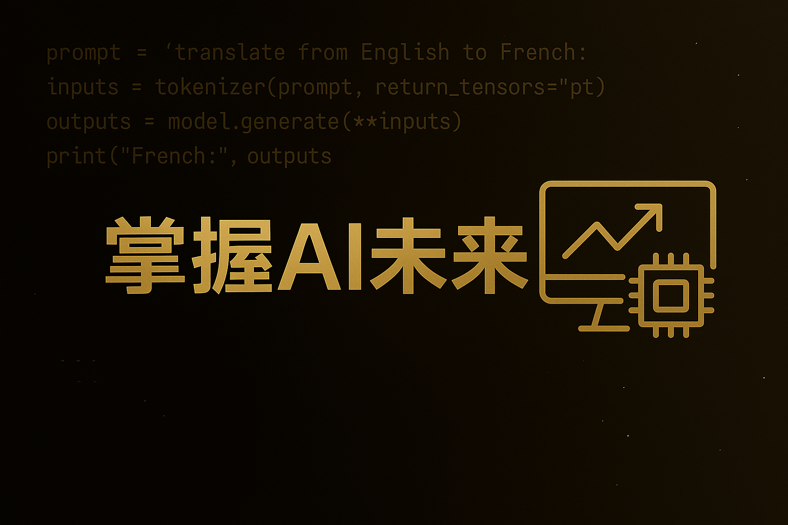
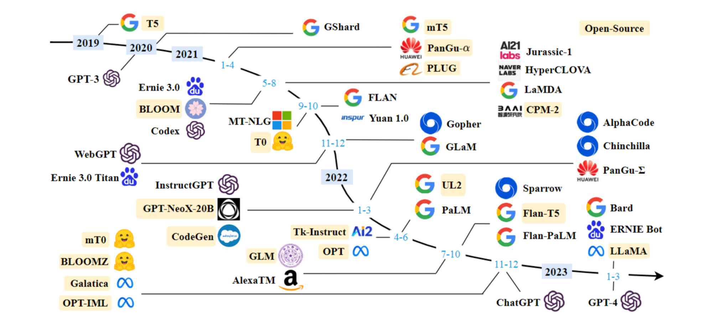

<!--
 * @Author: zhangting
 * @Date: 2025-05-22 11:37:41
 * @LastEditors: Do not edit
 * @LastEditTime: 2025-07-08 18:22:23
 * @FilePath: /zhangting/LLMHub/README.md
-->
# LLMHub

本项目旨在系统整理与分享深度学习与大语言模型（LLM）相关的核心知识、面试内容、实际应用场景及部署技巧。内容涵盖从基础概念、主流模型对比、Prompt 设计、模型微调到工程部署的完整流程，帮助开发者、研究者以及求职者高效掌握大模型领域的关键能力。

## 目录
- 📚 [计算机专业基础知识](./计算机专业基础知识/)
    - 📗 [计算机网络](./计算机专业基础知识/计算机网络.md)
    - 📘 [操作系统](./计算机专业基础知识/操作系统.md)
    - 📙 [数据库系统](./计算机专业基础知识/数据库系统.md)
- 🖥️ [开发](./开发/)
    - ⚒️ [开发工具](./开发/开发工具/)
        - 🔨[Git安装教程及常用命令！](./开发/开发工具/Git安装教程及常用命令！.md)
        - ⛏️[cursor使用教程！](./开发/开发工具/cursor使用教程！.md)
    - 🛠️ [开发语言](./开发/开发工具/)
        - 🐍 [Python知识点](./开发/Python知识点.md)
- 🐫 [深度学习](./deep-learning/)
    - 🐱 [神经网络](./deep-learning/神经网络/)
        - 😼[神经网络到底是什么？它是如何“模仿人脑”的？](./deep-learning/神经网络/什么是神经网络.md)
        - 😽[什么是梯度下降？为什么梯度下降能优化模型？](./deep-learning/神经网络/什么是梯度下降？为什么梯度下降能优化模型？.md)
        - 🙀[什么是反向传播？](./deep-learning/神经网络/什么是反向传播？.md)
        - 😻[如何用代码手写一个简单的神经网络，从0开始训练识别手写数字？](./deep-learning/神经网络/从0开始训练识别手写数字.md)
    - 🪄 [经典模型](./deep-learning/经典模型/)
        - 🐎 [RNN原理](./deep-learning/经典模型/RNN.md)
        - 🐏 [LSTM&GRU原理](./deep-learning/经典模型/LSTM&GRU.md)
        - 🎣 [Transformer原理](./deep-learning/经典模型/Transformer.md)
            - 🐳[一览Transformer整体架构](./deep-learning/经典模型/transformer/一览Transformer整体架构.md)
            - 🐋[Transformer——Attention怎么实现集中注意力](./deep-learning/经典模型/transformer/Transformer——Attention怎么实现集中注意力.md)
            - 🐬[Transformer——FeedForward模块在干什么？](./deep-learning/经典模型/transformer/Transformer——FeedForward模块在干什么？.md)
            - 🐟[从0开始实现Transformer](./deep-learning/经典模型/transformer/从0开始实现Transformer.md)
            - 🐳[KV-Cache](./deep-learning/经典模型/transformer/KV-Cache.md)
            - 🐠[MHA&MQA&GQA](./deep-learning/经典模型/transformer/MHA&MQA&GQA.md)
            - 🐡[FlashAttention](./deep-learning/经典模型/transformer/FlashAttention.md)
            - 🦈[FlashAttention2：更快的注意力机制，更好的并行效率](./deep-learning/经典模型/transformer/FlashAttention2：更快的注意力机制，更好的并行效率.md)
            - 🐙[FlashAttention3全解析：速度、精度、显存的再平衡](./deep-learning/经典模型/transformer/FlashAttention3%20全解析：速度、精度、显存的再平衡.md)
            - 🐟[FlashDecoding_让大模型推理提速的关键突破](./deep-learning/经典模型/transformer/FlashDecoding_让大模型推理提速的关键突破.md)
        - 🦋 [Bert原理](./deep-learning/经典模型/Bert.md)
    - 🐹 [基础知识](./deep-learning/基础知识.md)
    - 💽 [硬件加速库](./deep-learning/加速计算支持层（硬件加速库）.md)
- 🦜 [大模型](./大模型)
    - 📚 [基础知识](./大模型/基础知识.md)
        - 📕 [大模型幻觉：你信它，它却在胡说？](./大模型/大模型幻觉：你信它，它却在胡说？.md)
    - 🔔 [经典大模型](./大模型/经典大模型/)
        - 🏀 [GPT](./大模型/经典大模型/GPT/)
            - 🎱[GPT1：通用语言理解模型的开端](./大模型/经典大模型/GPT/GPT1：通用语言理解模型的开端.md)
            - ⚽ [GPT-2：让语言模型一统多任务学习江湖](./大模型/经典大模型/GPT/GPT-2：让语言模型一统多任务学习江湖.md)
            - ⚾ [GPT-3：真正意义上的少样本学习模型来了！](./大模型/经典大模型/GPT/GPT-3：真正意义上的少样本学习模型来了！.md)
            - 🥎[GPT‑3.5：从语言模型迈向对话智能的过渡之作](./大模型/经典大模型/GPT/GPT‑3.5：从语言模型迈向对话智能的过渡之作.md)
            - 🏐[GPT‑4：多模态大规模模型，开启更智能时代](./大模型/经典大模型/GPT/GPT‑4：多模态大规模模型，开启更智能时代.md)
            - ⚽ [GPT-5：天变了吗？还是风停了？](./大模型/经典大模型/GPT/GPT-5：天变了吗？还是风停了？.md)
        - 📣[LLAMA](./大模型/经典大模型/LLAMA/)
            - 📢[一文读懂LLAMA](./大模型/经典大模型/LLAMA/一文读懂LLAMA.md)
            - 🔈[LLaMA2-大模型开源了！](./大模型/经典大模型/LLAMA/LLaMA2-大模型开源了！.md)
            - 🔉[LLaMA3：离AGI更近一步？](./大模型/经典大模型/LLAMA/LLaMA%203：离%20AGI%20更近一步？.md)
        - 📠 [Grok](./大模型/经典大模型/Grok/)
            - 📱 [马斯克旗下xAI首个开源大模型全面解析](./大模型/经典大模型/Grok/Grok-1：马斯克旗下%20xAI%20首个开源大模型全面解析.md)
    - 📄 [协议](./协议/)
        - 📄 [MCP](./协议/大模型背后的协议与接口设计（一）-%20%20MCP.md)
    - ⌨ [微调技术](./大模型/微调技术/)
        - 🏃‍ [DeepSpeed原理](./大模型/微调技术/DeepSpeed.md)
        - 🏊‍ [LORA原理](./大模型/微调技术/LORA.md)
    - 🧐 [RAG](./RAG/doc/)
        - 🦋 [什么是RAG？一文搞懂检索增强生成技术](./大模型/RAG/doc/什么是RAG？一文搞懂检索增强生成技术.md)
        - 🤗[一文搞懂RAG 的文档解析](./大模型/RAG/doc/一文搞懂RAG%20的文档解析.md)
        - 🙂[一文搞懂RAG的切分策略](./大模型/RAG/doc/一文搞懂RAG的切分策略.md)
        - 😮[RAG-embedding篇](./大模型/RAG/doc/RAG-embedding篇.md)
        - 😜[RAG 信息检索：如何让模型找到‘对的知识’](./大模型/RAG/doc/RAG%20信息检索：如何让模型找到‘对的知识’.md)
    - 📑 [Data-Juicer原理及使用](./大模型/Data-Juicer.md)

正在更新ing，如果小伙伴对其他内容感兴趣欢迎联系我们😊😊！

如有侵权请联系删除。

微信公众号：*算法coting*，该公众号主要分享深度学习与大语言模型（LLM）相关的核心知识、面试内容、实际应用场景及部署技巧等。

想找人一起：\
&emsp;🤔 深夜讨论模型结构优化？\
&emsp;💡 头脑风暴科研点子？\
&emsp;🧪 分享面试、比赛、科研经验？\
那欢迎加入交流群【拿个大模型offer】\

在这里我们一起：\
&emsp;👉交流模型优化思路、训练加速技巧、复现经验；\
&emsp;👉分享博客内容背后的思考，探讨代码设计与实验细节；\
&emsp;👉吹水科研生活，也卷一卷代码人生。\

📌 群友包括：研究生、算法工程师、AI爱好者、自学深度学习的朋友们\
🎯 目标是：打造一个真·有价值的成长社区！\
📬 进群方式：扫描下方二维码添加我微信（备注“**LLM进群** ”）\
👇(由于人数限制，人数超过200就会加入新建的群) 

我相信： **“分享是一种信仰，连接让成长更有温度。”** 

如果你也在： 

寻找方向、沉淀能力； 
在技术 or 学术路上狂奔； 
希望有伙伴、有资源、有灵感…… 

那就关注我吧，我们一起成长，一起搞事情！ 

